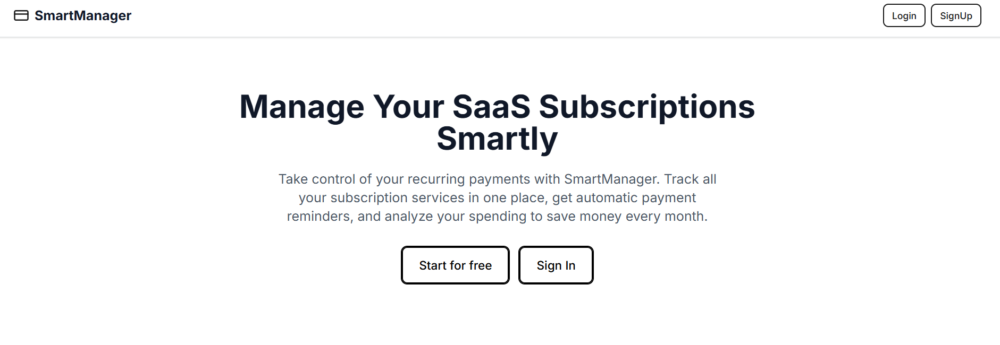
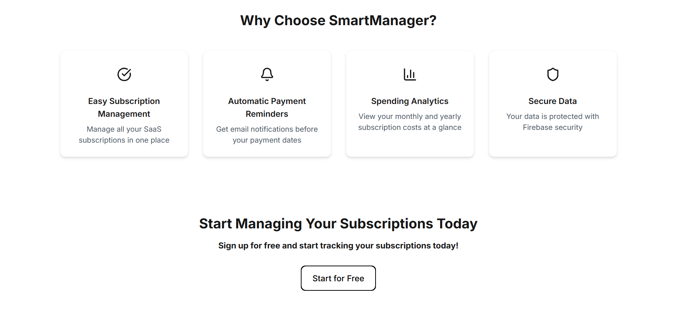
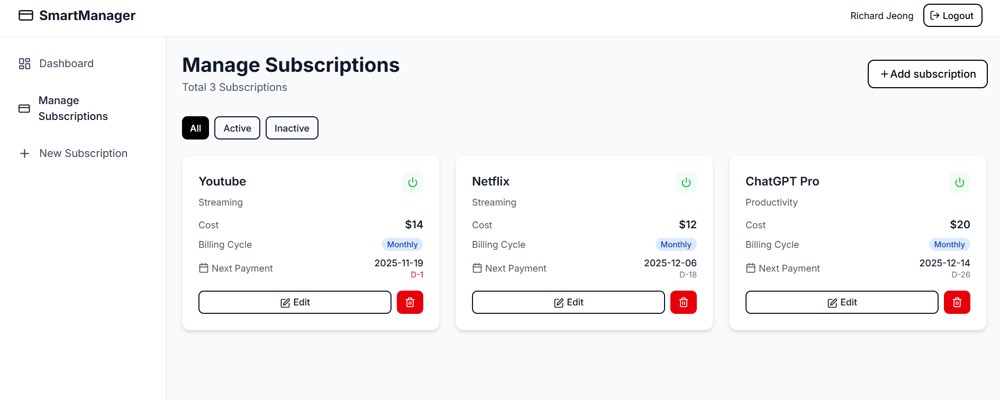

# 📊 SmartManager - Subscription Management SaaS

Manage all your subscriptions in one place with automated payment reminders.

## Screenshots







## ✨ Features

- 📱 Track all your subscriptions

- 💰 Monitor monthly/yearly spending
- 📧 Automated email reminders
- 📊 Visual analytics dashboard
- 🔒 Secure authentication

## 🚀 Live Demo

[View Live App](https://smartmanager-two.vercel.app)

## 🛠️ Tech Stack

- **Frontend:** Next.js 15, React, TypeScript, Tailwind CSS
- **Backend:** Firebase (Auth, Firestore, Functions)
- **Email:** Resend API
- **Deployment:** Vercel
- **Analytics:** Recharts

## 📦 Installation

### Prerequisites

- Node.js 20+
- Firebase account
- Resend API key

### Setup

1. Clone the repository

```bash
git clone https://github.com/ej84/smartmanager.git
cd smartmanager
```

2. Install dependencies

```bash
npm install
```

3. Set up environment variables

Create a `.env.local` file in the root directory:

```env
NEXT_PUBLIC_FIREBASE_API_KEY=your_api_key
NEXT_PUBLIC_FIREBASE_AUTH_DOMAIN=your_auth_domain
NEXT_PUBLIC_FIREBASE_PROJECT_ID=your_project_id
NEXT_PUBLIC_FIREBASE_STORAGE_BUCKET=your_storage_bucket
NEXT_PUBLIC_FIREBASE_MESSAGING_SENDER_ID=your_sender_id
NEXT_PUBLIC_FIREBASE_APP_ID=your_app_id
NEXT_PUBLIC_FIREBASE_MEASUREMENT_ID=your_measurement_id
```

4. Run the development server

```bash
npm run dev
```

5. Open [http://localhost:3000](http://localhost:3000)

## 🔒 Firebase Setup

1. Create a Firebase project at [console.firebase.google.com](https://console.firebase.google.com)
2. Enable Authentication (Email/Password)
3. Create a Firestore database
4. Deploy Firebase Functions (optional for email notifications)

## 📧 Email Notifications Setup

1. Sign up for [Resend](https://resend.com)
2. Get your API key
3. Add to Firebase Functions environment:

```bash
firebase functions:config:set resend.api_key="YOUR_KEY"
```

## 🚀 Deployment

### Vercel

1. Push to GitHub
2. Import project in Vercel
3. Add environment variables
4. Deploy!

## 📸 Screenshots

[Add screenshots here]

## 🤝 Contributing

Contributions are welcome! Please feel free to submit a Pull Request.

## 📝 License

This project is licensed under the MIT License - see the [LICENSE](LICENSE) file for details.

## 👨‍💻 Author

**Richard Jeong**

- LinkedIn: [Your LinkedIn](https://www.linkedin.com/in/rjeong397)
- GitHub: [@yourusername](https://github.com/ej84)

## 🙏 Acknowledgments

- Firebase for the backend infrastructure
- Vercel for hosting
- Resend for email services

---

⭐ If you found this project helpful, please give it a star and any feedback will be also appreciated!
